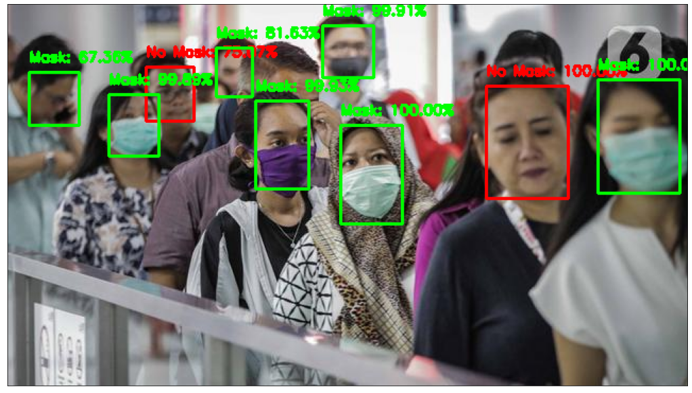
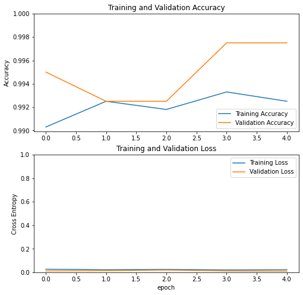

<h1 align="center">Face Mask Detection


[](https://GitHub.com/Cindyalifia/face-mask-detection/graphs/commit-activity)
[](https://github.com/Cindyalifia/face-mask-detection/stargazers)
[](https://www.linkedin.com/in/cindyalifiaputri/)
<h1>

## Intro

This code is inspired by my friend at Bangkit Academy LED by Google that want to help government to separate people who wear a mask or not. 

Consider that I train this model by using pre-trained model MobileNetV2 which you can read more here about MobileNetV2: [Documentation](https://www.tensorflow.org/api_docs/python/tf/keras/applications/MobileNetV2), [Architecture](https://tfhub.dev/s?network-architecture=mobilenet-v2), [Dataset](https://tfhub.dev/s?dataset=imagenet-ilsvrc-2012-cls).

You can found other demo's videos by following this directory   `./DEMO` or you can click here [Demo Result](https://github.com/Cindyalifia/face-mask-detection/tree/master/DEMO) or you can click this image bellow:

<p align="center">
  
</p>

## Dependencies
---

- Python 3
- tensorflow 2.1
- openCV
- matplotlib

## Dataset 
---
I load the data using `Kaggle API` which you can found here [Face Mask ~12K Images Dataset](https://www.kaggle.com/ashishjangra27/face-mask-12k-images-dataset). The size for all data is 329MB, with 10.000 images for training, 800 images for validation, and 992 images for testing.

### How To Run
---

Step to run this file is depend on what you're needed. 

1. You can clone this repository using this command 

```
https://github.com/Cindyalifia/face-mask-detection.git
```

2. If you just want to use **face mask classification**, you can download this python file `Predicting_Face_Mask.py` or by following this directory to read the notebook file to make you eazier to understand line by line of code `./IPYNB_FILE/Predicting_Face_Mask.ipynb`. After download it, you have to do this following steps:
- Download weight in this link to face mask classification model [model.05-0.00.h5](https://github.com/Cindyalifia/face-mask-detection/tree/master/MODEL)
- Run this command in your terminal which your python file exist
    ```
    python python_file_name.py --image directory_of_your_photos/photos_name.jpg
    ```
- And you'll get this result 
    ```
    prediction : name_of_class xx.xx%
    ```

3. If you want to build **face mask detector based on image**, you need to download this python file `DETECT_FACE_MASK.py` or you can follow this directory to read the notebook file `IPYNB_FILE\DETECT_FACE_MASK.ipynb`. These are steps that you must be followed.
- Download weight in this link to face mask classification model [model.05-0.00.h5](https://github.com/Cindyalifia/face-mask-detection/tree/master/MODEL).
- Download this caffee model in this directory `CAFFEE/deploy.prototxt` and `CAFFEE/res10_300x300_ssd_iter_140000.caffemodel`.
- Run this command in your terminal which your python file exist
    ```
    python python_file_name.py --image directory_of_your_photos/photos_name.jpg
    ```
- More or less, you'll get this result 



4. Last but not least, if you want to **detect whether people wearing mask or not with video based**, you can download this python file `video_face_mask_detection.py` I'm not creating a notebook file, because the latency when I load the videos on the colab is very high. These are steps that you must be followed.
- Download weight in this link to face mask classification model [model.05-0.00.h5](https://github.com/Cindyalifia/face-mask-detection/tree/master/MODEL).
- Download this caffee model in this directory `CAFFEE/deploy.prototxt` and `CAFFEE/res10_300x300_ssd_iter_140000.caffemodel`. Or you can download by clicking [this](https://github.com/Cindyalifia/face-mask-detection/tree/master/CAFFEE) link.
- Run this command in your terminal which your python file exist
    ```
    python python_file_name.py --image directory_of_your_videos/videos_name.mp4
    ```
- You'll get the result same with my DEMO file above.


## Design the net
---

Skip this if you are working with one of the original configurations since they are already there. Otherwise, see the following example:

```python
...

[Untrainable MobileNetV2 Layer]
[AveragePooling2D]
    -> pool_size=(7, 7)
[Flatten]
[Dense]
    -> 512 neuron
    -> activation="relu"
[Dropout]
    -> 0.5
[Dense]
    -> 128 neuron
    -> activation="relu"
[Dropout]
    -> 0.5
[Dense]
    -> 2 neuron
    -> activation="softmax"

...
```

## Training the model
---

In the training model, these are what I got :
- Total params: 2,979,778
- Trainable params: 721,794
- Non-trainable params: 2,257,984
Since we're not trying to retrain mobileNetV2 layer it's affected to the total of Non-trainable params. And the rest params is from my layer that I training.

## Accuracy of my model 
---
I got this accuracy when I train my model :




I've got `99,75%` accuracy for data validation, it's pretty good since the model can predict a new data almost all of them. 

## Android deployment
Hai, for the android deployment, I already build an apps that you can run or just download it and use it on yout device. You can found it here [https://github.com/Cindyalifia/tflite-face-mask-detection-android](https://github.com/Cindyalifia/tflite-face-mask-detection-android). 

I build two apps, one of them is to detect face mask detection by uploading a photos through your file which you can find here [FACE_MASK_DETECTION](https://github.com/Cindyalifia/tflite-face-mask-detection-android/tree/master/Upload_photos/FACE_MASK_DETECTION). 


Another one is to build face mask detection in live stream which you can find here [FACE_MASK_DETECTION LIVE_STREAMING](https://github.com/Cindyalifia/tflite-face-mask-detection-android/tree/master/Live_detection/FACE_MASK_DETECTION%20LIVE_STREAMING).
